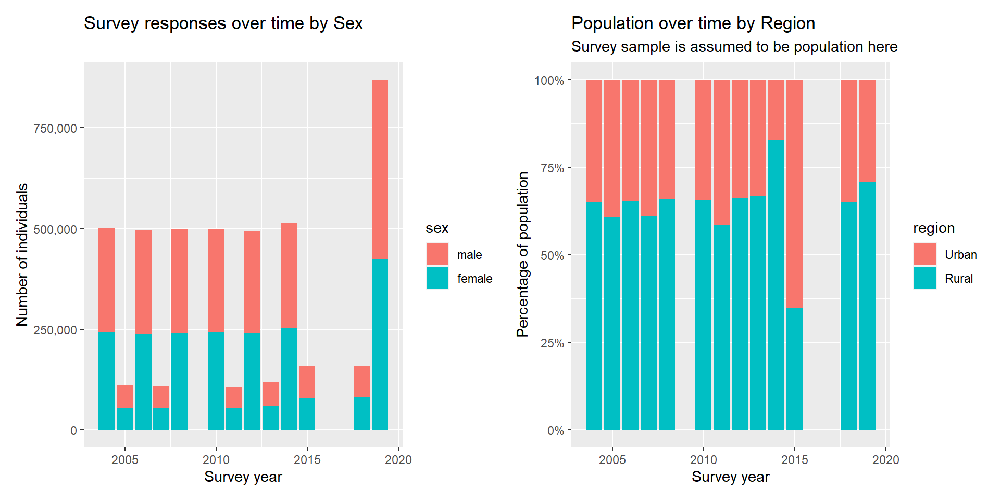

# (PART) Sections of the survery {-} 

# The Household Roster


```{.r .numberLines}
library(tidyverse)
library(lubridate)
library(scales)
library(patchwork)
```

I load the survey roster data for each year and combine it into a single tibble/dataframe for easy analysis. 

I have specified a few columns directly as the correct datatypes using the `col_types` argument and if I had a targetted analysis in mind I would have used `cols_only` to save time and memory. Then I manually fix inconsistent encoding in factor columns and set certain sentinel values to NA using information from the questionnaire pdf. I also create a `has_spouse` column which I will extensively use for the analysis as a simplification of marital status which usually contains other statuses like divorced, engaged etc. Similarly I make an `age_group` column to group analyses/plots later. 

*There are parsing errors for some columns. I find it better to just choose the required columns for the analysis with `cols_only` and manually specify types for them then manually fix encoding issues.*


```{.r .numberLines}
root_dir <- "C:/Users/R/Desktop/pslm/data_clean"
year_dirs <- head(list.dirs(root_dir, recursive = F), -1)
all_files <- map(year_dirs, function(year_dir) paste(year_dir, "1 - HH_roster.csv", sep="/"))

# specifying columns which are missing from the file in cols_only() causes a warning
# since I can't do anything about missing columns I've suppressed the warnings here
roster <- map_dfr(all_files, read_csv, col_types = cols(year = "i",
                                                        hhcode = "d",
                                                        idc = "d",
                                                        sex = "f",
                                                        age = "d",
                                                        spouse_idc = "d",
                                                        province = "c",
                                                        district = "f",
                                                        region = "c")) %>% 
  mutate(year = floor_date(as.Date(as.character(year), format="%Y"), unit = "year"),
         spouse_idc = as.integer(na_if(na_if(spouse_idc, 98), 99)),
         region = as_factor(recode(region, 
                                   rural = "Rural", urban = "Urban")),
         province = as_factor(recode(province, 
                                     punjab = "Punjab", sindh = "Sindh", nwfp = "KPK", balochistan = "Balochistan",
                                     NWFP = "KPK", "khyber pakhtunkhwa" = "KPK", kpk = "KPK", kp = "KPK")),
         has_spouse = !is.na(spouse_idc),
         age_group = cut(age, 
                         breaks = c(0, 12, 19, 30, 60, 100), 
                         labels = c("Child", "Teenager", "Young Adult", "Adult", "Senior"), 
                         ordered_result = TRUE, include.lowest = TRUE))
```

Each individual in the survey is uniquely identified by a triplet of (year, hhcode, idc) where `year` is the year of survey, `hhcode` is household code/ID and `idc` is person ID *within the household*. There are some demographic variables telling age, sex, location of the individual. The `spouse_idc` column contains the ID code of the spouse of the individual (implicit fact: the spouse belongs to the same household). An NA here represents unmarried individuals. 


```{.r .numberLines}
head(roster)
```

```
## # A tibble: 6 x 32
##   year        hhcode province district region startum    psu  hhno section   idc
##   <date>       <dbl> <fct>    <fct>    <fct>    <dbl>  <dbl> <dbl> <chr>   <dbl>
## 1 2004-01-01  1.00e9 Punjab   islamab~ Urban        2 1.00e7     1 B           2
## 2 2004-01-01  1.00e9 Punjab   islamab~ Urban        2 1.00e7     1 B           3
## 3 2004-01-01  1.00e9 Punjab   islamab~ Urban        3 1.00e7     8 B           6
## 4 2004-01-01  1.00e9 Punjab   islamab~ Urban        3 1.00e7     7 B           6
## 5 2004-01-01  1.00e9 Punjab   islamab~ Urban        3 1.00e7    12 B           2
## 6 2004-01-01  1.00e9 Punjab   islamab~ Urban        3 1.00e7     8 B           3
## # ... with 22 more variables: sex <fct>, residential_status <chr>,
## #   relationship_w_head <chr>, age <dbl>, marital_status <chr>, pcode <dbl>,
## #   weights <dbl>, dob_d <dbl>, dob_m <dbl>, dob_y <dbl>, spouse_idc <int>,
## #   father_idc <dbl>, mother_idc <dbl>, is_hh_member <chr>, weight <dbl>,
## #   hh <dbl>, reason_for_head <chr>, hhcode_new <dbl>, stratum <dbl>,
## #   psu_new <dbl>, has_spouse <lgl>, age_group <ord>
```

The survey follows a tick-tock pattern alternating between province and district distributed surveys. However the male/female ratio is pretty consistent around 50% which is to be expected. The majority of population lives in rural areas in Pakistan. 


```{.r .numberLines}
p1 <- roster %>% 
  count(year, sex) %>% 
  ggplot(aes(x = year, y = n, fill = sex)) + 
  geom_col() + 
  scale_y_continuous(labels = comma) + 
  labs(title = "Survey responses over time by Sex") + 
  xlab("Survey year") + 
  ylab("Number of individuals")

p2 <- roster %>% 
  count(year, region) %>%
  group_by(year) %>% 
  mutate(pct = n / sum(n)) %>% 
  ggplot(aes(x = year, y = pct, fill = region)) +
  geom_col() +
  scale_y_continuous(labels = percent) +
  labs(title = "Population over time by Region",
       subtitle = "Survey sample is assumed to be population here") +
  xlab("Survey year") +
  ylab("Percentage of population")

p1 + p2
```



Since the survey questionnaire changes across years and some questions are not asked there are some columns with significant variations in the available data. This is before considering that even if a question is asked the respondent might not provide/know the answer. 


```{.r .numberLines}
roster %>% 
  group_by(year) %>% 
  summarise_all(~ mean(!is.na(.)))
```

```
## # A tibble: 13 x 32
##    year       hhcode province district region startum   psu  hhno section   idc
##    <date>      <dbl>    <dbl>    <dbl>  <dbl>   <dbl> <dbl> <dbl>   <dbl> <dbl>
##  1 2004-01-01      1        1        1      1       1     1     1       1     1
##  2 2005-01-01      1        1        0      1       0     1     0       0     1
##  3 2006-01-01      1        1        1      1       0     1     0       1     1
##  4 2007-01-01      1        1        0      1       0     1     0       1     1
##  5 2008-01-01      1        1        1      1       0     1     0       1     1
##  6 2010-01-01      1        1        1      1       0     1     0       1     1
##  7 2011-01-01      1        1        0      1       0     1     0       1     1
##  8 2012-01-01      1        1        1      1       0     1     0       1     1
##  9 2013-01-01      1        1        0      1       0     1     0       0     1
## 10 2014-01-01      1        1        1      1       0     1     0       1     1
## 11 2015-01-01      1        1        0      1       0     1     0       1     1
## 12 2018-01-01      1        1        0      1       0     1     0       0     1
## 13 2019-01-01      1        1        1      1       0     1     0       0     1
## # ... with 22 more variables: sex <dbl>, residential_status <dbl>,
## #   relationship_w_head <dbl>, age <dbl>, marital_status <dbl>, pcode <dbl>,
## #   weights <dbl>, dob_d <dbl>, dob_m <dbl>, dob_y <dbl>, spouse_idc <dbl>,
## #   father_idc <dbl>, mother_idc <dbl>, is_hh_member <dbl>, weight <dbl>,
## #   hh <dbl>, reason_for_head <dbl>, hhcode_new <dbl>, stratum <dbl>,
## #   psu_new <dbl>, has_spouse <dbl>, age_group <dbl>
```

