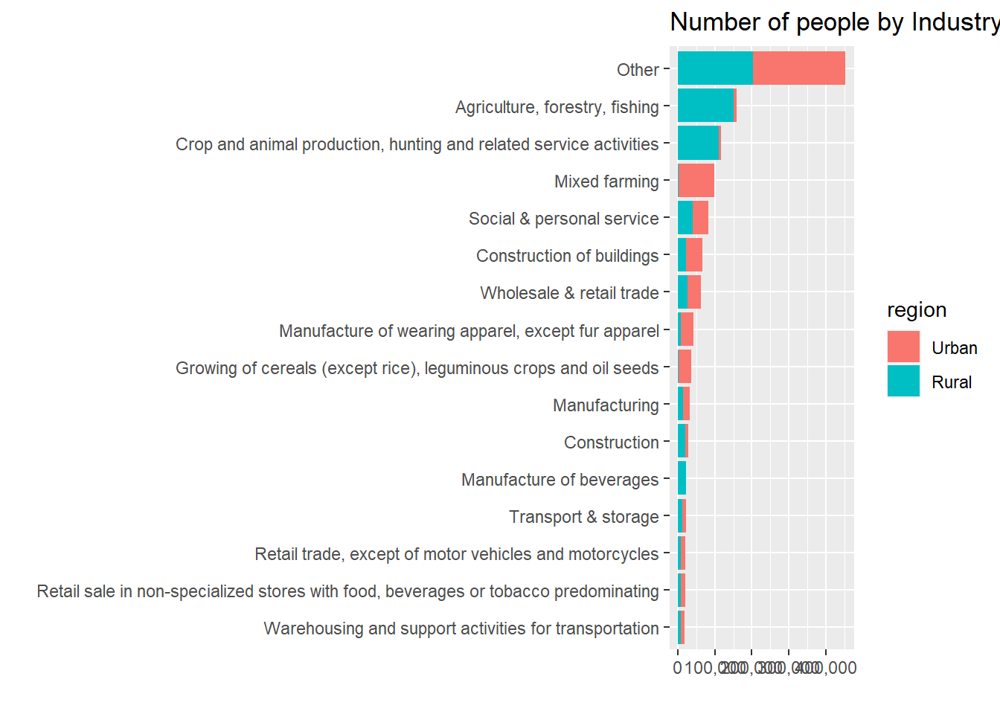
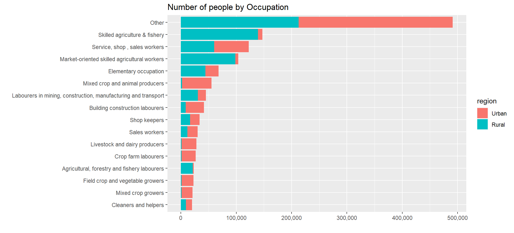
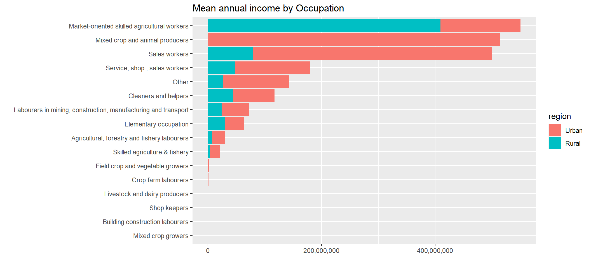
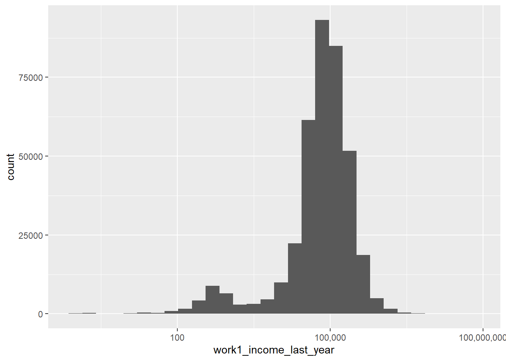
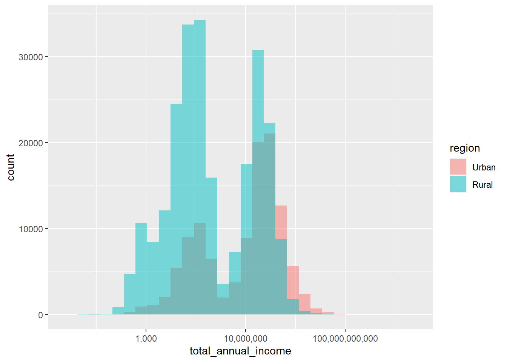
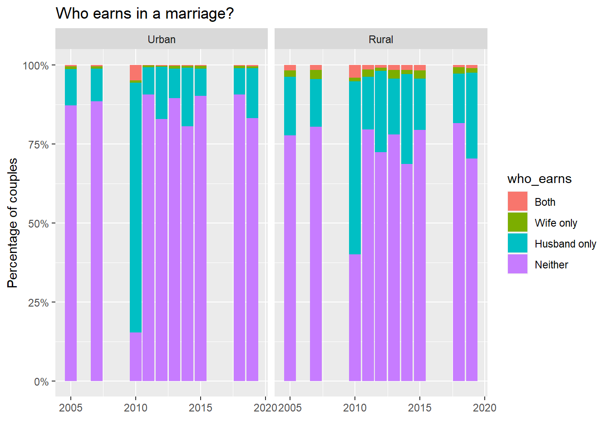
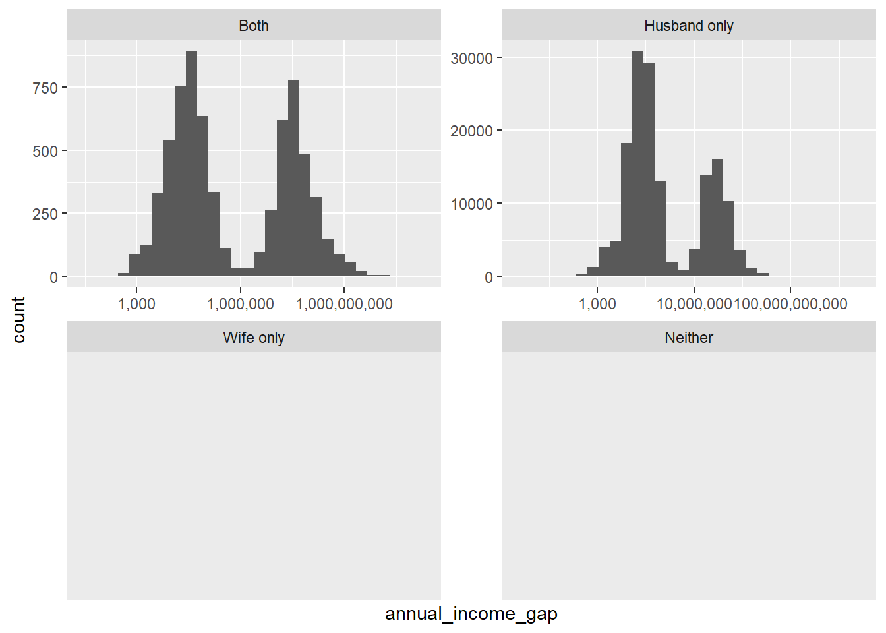

# (PART) Detailed Analyses {-} 

# Marriages in Pakistan


There are many well-known problems regarding marriages in Pakistan like child marriage, forced marriage etc. I want to investigate these phenomenon through simple analysis of the Pakistan Social And Living Standards Measurement Survey (PSLM). This is the most frequent and up-to-date demographic survey conducted in Pakistan with sufficient detail to allow interesting explorations through the data. 

I will be using R/tidyverse for the rest of the analysis. 


```{.r .numberLines}
library(tidyverse)
library(lubridate)
library(scales)
library(patchwork)
library(ggrepel)
library(ggforce)
```

I load the survey roster data for each year and combine it into a single tibble/dataframe for easy analysis. There are a lot of columns which I don't plan to use for this analysis so I just read the relevant ones in the appropriate datatypes also there are encoding issues in this table and some columns are missing from certain years. I can't do much about the missing columns but I manually fix inconsistent encoding in factor columns and set certain sentinel values to NA using information from the questionnaire pdf. I also create a `has_spouse` column which I will extensively use for the analysis as a simplification of marital status which usually contains other statuses like divorced, engaged etc. Similarly I make an `age_group` column to group analyses/plots later. 


```{.r .numberLines}
root_dir <- "C:/Users/R/Desktop/pslm/data_clean"
year_dirs <- head(list.dirs(root_dir, recursive = F), -1)
all_files <- map(year_dirs, function(year_dir) paste(year_dir, "1 - HH_roster.csv", sep="/"))

# specifying columns which are missing from the file in cols_only() causes a warning
# since I can't do anything about missing columns I've suppressed the warnings here
roster <- map_dfr(all_files, read_csv, col_types = cols_only(year = "i",
                                                             hhcode = "d",
                                                             idc = "d",
                                                             sex = "f",
                                                             age = "d",
                                                             spouse_idc = "d",
                                                             province = "c",
                                                             district = "f",
                                                             region = "c")) %>% 
  mutate(year = floor_date(as.Date(as.character(year), format="%Y"), unit = "year"),
         spouse_idc = as.integer(na_if(na_if(spouse_idc, 98), 99)),
         region = as_factor(recode(region, 
                                   rural = "Rural", urban = "Urban")),
         province = as_factor(recode(province, 
                                     punjab = "Punjab", sindh = "Sindh", nwfp = "KPK", balochistan = "Balochistan",
                                     NWFP = "KPK", "khyber pakhtunkhwa" = "KPK", kpk = "KPK", kp = "KPK")),
         has_spouse = !is.na(spouse_idc),
         age_group = cut(age, 
                         breaks = c(0, 12, 19, 30, 60, 100), 
                         labels = c("Child", "Teenager", "Young Adult", "Adult", "Senior"), 
                         ordered_result = TRUE, include.lowest = TRUE))
```

Each individual in the survey is uniquely identified by a triplet of (year, hhcode, idc) where `year` is the year of survey, `hhcode` is household code/ID and `idc` is person ID *within the household*. There are some demographic variables telling age, sex, location of the individual. The `spouse_idc` column contains the ID code of the spouse of the individual (implicit fact: the spouse belongs to the same household). An NA here represents unmarried individuals. 


```{.r .numberLines}
head(roster)
```

```
## # A tibble: 6 x 11
##   year           hhcode province district  region   idc sex     age spouse_idc
##   <date>          <dbl> <fct>    <fct>     <fct>  <dbl> <fct> <dbl>      <int>
## 1 2004-01-01 1001200501 Punjab   islamabad Urban      2 male     27         NA
## 2 2004-01-01 1001200501 Punjab   islamabad Urban      3 male     25         NA
## 3 2004-01-01 1001300108 Punjab   islamabad Urban      6 male     34         NA
## 4 2004-01-01 1001300207 Punjab   islamabad Urban      6 male     26         NA
## 5 2004-01-01 1001300212 Punjab   islamabad Urban      2 male     70         NA
## 6 2004-01-01 1001300308 Punjab   islamabad Urban      3 male     40         NA
## # ... with 2 more variables: has_spouse <lgl>, age_group <ord>
```

To see the number of married individuals I need to choose a single gender in order to avoid double counting since marriage is a symmetric relationship. It seems like there were no married people in 2004 and 2008 but this is obviously incorrect. The survey questionnaire did not contain a field for `spouse_idc` in these years. While we can use the `marital_status` column I have chosen to skip these years since I need the `spouse_idc` for the couple-level analysis I want to do. 


```{.r .numberLines}
roster %>% 
  filter(sex == "male") %>%
  count(year, has_spouse) %>% 
  group_by(year) %>% 
  mutate(pct = n / sum(n)) %>% 
  ggplot(aes(x = year, y = pct, fill = has_spouse)) +
  geom_col() +
  # scale_x_date(breaks = date_ticks, date_labels = "%Y") +
  scale_y_continuous(labels = percent) +
  labs(title = "Marital Status over time") +
  xlab("Survey year") +
  ylab("Percentage of married individuals")
```


## Underage marriages

I want to see the youngest married individuals in each year. This looks very alarming since there are a lot of children with spouses in the dataset. Even more shocking is that none of the youngest married individuals are over the legal marriage age of 18. 


```{.r .numberLines}
roster %>% 
  filter(has_spouse) %>% 
  group_by(year, region, sex) %>% 
  summarise(age = min(age)) %>% 
  ggplot(aes(x = year, y = age, color = sex, shape = sex)) + 
  geom_point(size = 5) +
  facet_wrap(~region) + 
  # scale_x_date(breaks = date_ticks, date_labels = "%Y") +
  labs(title = "Youngest married individuals") +
  xlab("Survey year") +
  ylab("Age")
```


In the numbers for just underage married individuals very few are below the age of 12 (children) and majority are in their teens (up to 17 only). 


```{.r .numberLines}
roster %>% 
  filter(has_spouse, age < 18) %>% 
  count(year, age_group) %>% 
  ggplot(aes(x = year, y = n, fill = age_group)) + 
  geom_col() + 
  # scale_x_date(breaks = date_ticks, date_labels = "%Y") +
  labs(title = "Number of underage married individuals") +
  xlab("Survey year") +
  ylab("Number of individuals")
```


## Age-gap in couples

Now I will create couple pairings using `idc` and `spouse_idc` columns from the roster. At this point my unit-of-analysis is a couple instead of an individual so one row in my dataframe should correspond to one couple. This causes repetitive names since each couple contains two individuals. The variable of interest here is `age_gap` which shows how much older the husband is compared to the wife. 


```{.r .numberLines}
males <- roster %>% 
  filter(has_spouse, sex == "male") 

females <- roster %>% 
  filter(has_spouse, sex == "female") 
  
couples <- males %>% 
  inner_join(females, 
             by = c("spouse_idc" = "idc", "hhcode" = "hhcode", "year" = "year"), 
             suffix = c(".husband", ".wife")) %>% 
  mutate(age_gap = age.husband - age.wife) %>% 
  rename(province = province.husband, district = district.husband, region = region.husband,
         idc.husband = idc, idc.wife = spouse_idc) %>% 
  select(-province.wife, -district.wife, -region.wife, -sex.husband, -sex.wife, 
         -has_spouse.husband, -has_spouse.wife, -spouse_idc.wife) %>% 
  select(year, hhcode, province, district, region, 
         idc.husband, age.husband, age_group.husband,
         idc.wife, age.wife, age_group.wife,
         age_gap)

# temporary tables removed after use to free up memory
rm(males, females)

head(couples)
```

```
## # A tibble: 6 x 12
##   year           hhcode province district region idc.husband age.husband
##   <date>          <dbl> <fct>    <fct>    <fct>        <dbl>       <dbl>
## 1 2005-01-01 1011010101 Punjab   <NA>     Urban            1          64
## 2 2005-01-01 1011010102 Punjab   <NA>     Urban            1          35
## 3 2005-01-01 1011010103 Punjab   <NA>     Urban            1          70
## 4 2005-01-01 1011010104 Punjab   <NA>     Urban            1          40
## 5 2005-01-01 1011010105 Punjab   <NA>     Urban            1          49
## 6 2005-01-01 1011010106 Punjab   <NA>     Urban            1          30
## # ... with 5 more variables: age_group.husband <ord>, idc.wife <dbl>,
## #   age.wife <dbl>, age_group.wife <ord>, age_gap <dbl>
```

The first thing I want to see is if there is any correlation between the ages of spouses. There appears to be a near-perfect linear trend as seen with the reference diagonal line (representing no age gap). Most of the points are to the lower-right of the line meaning most couples have a slightly older husband. An interesting thing to note here is that there are more men with the max age (99) than women. In the questionnaire age over 100 is supposed to be represented as 99. 

There are more outliers with large age gaps in the lower-right triangle than in the upper-left one. This means that where are more couples where the husband is older than the wife. There also seem to be more couples with older husbands in rural region. 


```{.r .numberLines}
ggplot(couples, aes(x = age.husband, y = age.wife)) + 
  geom_point(aes(color = abs(age_gap) > 30), alpha = 0.1) +
  scale_color_manual(values = c("#C3C3C3", "#198D8D")) + 
  geom_abline(slope = 1, intercept = 0, linetype = "dashed") +
  coord_fixed() +
  facet_wrap(~ region) + 
  xlab("Husband's age") +
  ylab("Wife's age")
```


avg by district


```{.r .numberLines}
couples %>% 
  group_by(region, district) %>% 
  summarise(avg_age.husband = median(age.husband),
            avg_age.wife = median(age.wife)) %>% 
  ggplot(aes(x = avg_age.husband, y = avg_age.wife, color = region)) + 
  geom_jitter() + 
  geom_abline(slope = 1, intercept = 0, linetype = "dashed") +
  coord_fixed() +
  xlab("Average husband's age") +
  ylab("Average wife's age")
```


The distribution of age gap over the years has remained pretty consistent. The age gap for rural couples is much more tightly distributed around the mean than the urban even though in the previous chart we saw that rural region has more extreme values (this isn't visible in this chart because of small scale). 


```{.r .numberLines}
ggplot(couples, aes(x = age_gap, y = after_stat(density), fill = region)) +
  geom_histogram(binwidth = 5, alpha = 0.5) +
  facet_wrap(~ year) + 
  labs(title = "Distribution of Age gap by Year and Region", 
       subtitle = "Positive gap denotes older husband and vice versa") +
  xlab("Age gap")
```


Since there are no differences across years we can ignore that dimension and look more closely at differences across regions. 

In both regions the median is positive most couples have a slightly older husband. The rural region does indeed have a tighter distribution around 0 but it also has more extreme cases. Qualitatively, it seems like in rural areas it is much more likely to have a partner almost exactly the same age as you or to have a much older husband (more common) or wife (less common). 


```{.r .numberLines}
median_gap_by_region <- couples %>% 
  group_by(region) %>% 
  summarise(med = median(age_gap)) %>% 
  mutate(label = str_c('Median:', format(med, nsmall = 1)))

ggplot() +
  geom_boxplot(data = couples, 
               mapping = aes(x = age_gap, y = region, color = region), 
               show.legend = FALSE) + 
  geom_label_repel(data = median_gap_by_region, 
                  mapping = aes(x = med, y = region, label = label)) + 
  labs(title = "Distribution of Age gap by Region", 
       subtitle = "Positive gap denotes older husband and vice versa") +
  xlab("Age gap") + 
  ylab("Region")
```


## Income-gap in couples

Let's load the income data from PSLM files as well. 

*Since this is just an illustrative exercise for simplicity I am only looking at reported annual cash income.*


```{.r .numberLines}
all_files <- map(year_dirs, function(year_dir) paste(year_dir, "4 - Employment.csv", sep="/"))

# specifying columns which are missing from the file in cols_only() causes a warning
# since I can't do anything about missing columns I've suppressed the warnings here
income <- map_dfr(all_files, read_csv, col_types = cols_only(year = "i",
                                                             hhcode = "d",
                                                             idc = "d",
                                                             work1_income_last_month = "d",
                                                             work1_months_worked_last_year	 = "d",
                                                             work1_income_last_year = "d",
                                                             work1_occupation = "c",
                                                             work1_industry = "c",
                                                             province = "c",
                                                             region = "c")) %>% 
  mutate(year = floor_date(as.Date(as.character(year), format="%Y"), unit = "year"),
         region = as_factor(recode(region, 
                                   rural = "Rural", urban = "Urban")),
         province = as_factor(recode(province, 
                                     punjab = "Punjab", sindh = "Sindh", nwfp = "KPK", balochistan = "Balochistan",
                                     NWFP = "KPK", "khyber pakhtunkhwa" = "KPK", kpk = "KPK", kp = "KPK")),
         work1_income_last_year.calc = work1_income_last_month * work1_income_last_month,
         work1_occupation = as_factor(str_to_sentence(work1_occupation)),
         work1_industry = as_factor(str_to_sentence(work1_industry))
         )
```


```{.r .numberLines}
head(income)
```

```
## # A tibble: 6 x 11
##   year        hhcode province region   idc work1_occupation     work1_industry  
##   <date>       <dbl> <fct>    <fct>  <dbl> <fct>                <fct>           
## 1 2004-01-01  1.00e9 Punjab   Urban      1 Service, shop , sal~ Social & person~
## 2 2004-01-01  1.00e9 Punjab   Urban      2 Service, shop , sal~ Social & person~
## 3 2004-01-01  1.00e9 Punjab   Urban      3 <NA>                 <NA>            
## 4 2004-01-01  1.00e9 Punjab   Urban      4 <NA>                 <NA>            
## 5 2004-01-01  1.00e9 Punjab   Urban      1 Service, shop , sal~ Social & person~
## 6 2004-01-01  1.00e9 Punjab   Urban      2 <NA>                 <NA>            
## # ... with 4 more variables: work1_income_last_month <dbl>,
## #   work1_months_worked_last_year <dbl>, work1_income_last_year <dbl>,
## #   work1_income_last_year.calc <dbl>
```


```{.r .numberLines}
plot_categorical <- function(tbl, cat_col, n_levels = 10, 
                             order_col, order_fun, 
                             do_agg = FALSE, agg_col = NULL, agg_fun = NULL) {
  result <- tbl %>% 
    filter(!is.na({{ cat_col }})) %>%
    mutate({{ cat_col }} := fct_lump_n({{ cat_col }}, n_levels),
           {{ cat_col }} := fct_reorder({{ cat_col }}, {{ order_col }}, .fun = order_fun)) %>%
    group_by({{ cat_col }}, region)
  
  if (do_agg) {
    print(c("h1", substitute(agg_fun), as.character(enquo(agg_col))))
    print(result)
    result <- result %>% summarize(aggregated = agg_fun({{agg_col}}))
    # print(result)
  } else {
    # print(c("h2", agg_col))
    # This will run for count aggregations only
    result <- result %>% summarize(aggregated = n())
  }
  
  result %>% 
    ggplot(aes(aggregated, {{ cat_col }}, fill = region)) +
    geom_col() +
    scale_x_continuous(labels = label_comma())
}

income %>% 
  plot_categorical(work1_occupation, 15, hhcode, length) +
  labs(x = "", y = "", title = "Number of people by Occupation")
```


```{.r .numberLines}
income %>% 
  plot_categorical(work1_industry, 15, hhcode, length) +
  labs(x = "", y = "", title = "Number of people by Industry")
```




```{.r .numberLines}
income %>% 
  plot_categorical(work1_occupation, 15, work1_income_last_year, median, TRUE, work1_income_last_year, median) +
  labs(x = "", y = "", title = "Median annual salary by Occupation")
```

```
## Warning: Using `as.character()` on a quosure is deprecated as of rlang 0.3.0.
## Please use `as_label()` or `as_name()` instead.
## This warning is displayed once per session.
```

```
## [[1]]
## [1] "h1"
## 
## [[2]]
## median
## 
## [[3]]
## [1] "~"
## 
## [[4]]
## [1] "work1_income_last_year"
## 
## # A tibble: 1,280,159 x 11
## # Groups:   work1_occupation, region [32]
##    year        hhcode province region   idc work1_occupation    work1_industry  
##    <date>       <dbl> <fct>    <fct>  <dbl> <fct>               <fct>           
##  1 2004-01-01  1.00e9 Punjab   Urban      1 Service, shop , sa~ Social & person~
##  2 2004-01-01  1.00e9 Punjab   Urban      2 Service, shop , sa~ Social & person~
##  3 2004-01-01  1.00e9 Punjab   Urban      1 Service, shop , sa~ Social & person~
##  4 2004-01-01  1.00e9 Punjab   Urban      1 Other               Social & person~
##  5 2004-01-01  1.00e9 Punjab   Urban      1 Elementary occupat~ Social & person~
##  6 2004-01-01  1.00e9 Punjab   Urban      1 Other               Social & person~
##  7 2004-01-01  1.00e9 Punjab   Urban      8 Other               Social & person~
##  8 2004-01-01  1.00e9 Punjab   Urban      1 Other               Electricity     
##  9 2004-01-01  1.00e9 Punjab   Urban      3 Service, shop , sa~ Social & person~
## 10 2004-01-01  1.00e9 Punjab   Urban      1 Other               Social & person~
## # ... with 1,280,149 more rows, and 4 more variables:
## #   work1_income_last_month <dbl>, work1_months_worked_last_year <dbl>,
## #   work1_income_last_year <dbl>, work1_income_last_year.calc <dbl>
```

```
## `summarise()` has grouped output by 'work1_occupation'. You can override using the `.groups` argument.
```

```
## Warning: Removed 32 rows containing missing values (position_stack).
```



```{.r .numberLines}
income %>% 
  plot_categorical(work1_industry, 15, work1_income_last_year, median, TRUE, work1_income_last_year, median) +
  labs(x = "", y = "", title = "Median annual salary by Industry")
```

```
## [[1]]
## [1] "h1"
## 
## [[2]]
## median
## 
## [[3]]
## [1] "~"
## 
## [[4]]
## [1] "work1_income_last_year"
## 
## # A tibble: 1,280,417 x 11
## # Groups:   work1_industry, region [32]
##    year        hhcode province region   idc work1_occupation    work1_industry  
##    <date>       <dbl> <fct>    <fct>  <dbl> <fct>               <fct>           
##  1 2004-01-01  1.00e9 Punjab   Urban      1 Service, shop , sa~ Social & person~
##  2 2004-01-01  1.00e9 Punjab   Urban      2 Service, shop , sa~ Social & person~
##  3 2004-01-01  1.00e9 Punjab   Urban      1 Service, shop , sa~ Social & person~
##  4 2004-01-01  1.00e9 Punjab   Urban      1 Professionals       Social & person~
##  5 2004-01-01  1.00e9 Punjab   Urban      1 Elementary occupat~ Social & person~
##  6 2004-01-01  1.00e9 Punjab   Urban      1 Professionals       Social & person~
##  7 2004-01-01  1.00e9 Punjab   Urban      8 Senior officals / ~ Social & person~
##  8 2004-01-01  1.00e9 Punjab   Urban      1 Clerks              Other           
##  9 2004-01-01  1.00e9 Punjab   Urban      3 Service, shop , sa~ Social & person~
## 10 2004-01-01  1.00e9 Punjab   Urban      1 Clerks              Social & person~
## # ... with 1,280,407 more rows, and 4 more variables:
## #   work1_income_last_month <dbl>, work1_months_worked_last_year <dbl>,
## #   work1_income_last_year <dbl>, work1_income_last_year.calc <dbl>
```

```
## `summarise()` has grouped output by 'work1_industry'. You can override using the `.groups` argument.
```

```
## Warning: Removed 32 rows containing missing values (position_stack).
```


income over time


```{.r .numberLines}
income %>% 
  filter(!is.na(work1_income_last_year)) %>% 
  ggplot(aes(x = year, y = work1_income_last_year, group = interaction(year, region), fill = region)) + 
  geom_boxplot() + 
  scale_y_log10(labels = label_comma()) + 
  labs(x = "", y = "Annual Income (PKR)")
```

```
## Warning: Transformation introduced infinite values in continuous y-axis
```

```
## Warning: Removed 514542 rows containing non-finite values (stat_boxplot).
```



income over time married/unmarried by sex


```{.r .numberLines}
roster_enriched <- roster %>% 
  left_join(income %>% select(year,hhcode,idc,work1_income_last_year,work1_occupation,work1_industry),by = c("year","hhcode","idc"))

head(roster_enriched)
```

```
## # A tibble: 6 x 14
##   year           hhcode province district  region   idc sex     age spouse_idc
##   <date>          <dbl> <fct>    <fct>     <fct>  <dbl> <fct> <dbl>      <int>
## 1 2004-01-01 1001200501 Punjab   islamabad Urban      2 male     27         NA
## 2 2004-01-01 1001200501 Punjab   islamabad Urban      3 male     25         NA
## 3 2004-01-01 1001300108 Punjab   islamabad Urban      6 male     34         NA
## 4 2004-01-01 1001300207 Punjab   islamabad Urban      6 male     26         NA
## 5 2004-01-01 1001300212 Punjab   islamabad Urban      2 male     70         NA
## 6 2004-01-01 1001300308 Punjab   islamabad Urban      3 male     40         NA
## # ... with 5 more variables: has_spouse <lgl>, age_group <ord>,
## #   work1_income_last_year <dbl>, work1_occupation <fct>, work1_industry <fct>
```

There is a slight bimodal pattern in the income distribution. 


```{.r .numberLines}
roster_enriched %>%
  ggplot(aes(work1_income_last_year)) + 
  geom_histogram() + 
  scale_x_log10(labels = comma)
```

```
## Warning: Transformation introduced infinite values in continuous x-axis
```

```
## `stat_bin()` using `bins = 30`. Pick better value with `binwidth`.
```

```
## Warning: Removed 4250222 rows containing non-finite values (stat_bin).
```



effect of age and marriage on income. The second mode is significantly stronger in unmarried rural people. 


```{.r .numberLines}
roster_enriched %>% 
  filter(!is.na(work1_income_last_year), work1_income_last_year > 0,
         !is.na(age)) %>% 
  ggplot(aes(x = age, y = work1_income_last_year, color = has_spouse)) + 
  geom_mark_ellipse(aes(filter = between(work1_income_last_year, 50, 1000) & between(age, 20, 80)), 
                    color = "black") +
  geom_point(alpha = 0.1) + 
  scale_y_log10(labels = label_comma()) +
  guides(color = guide_legend(override.aes = list(alpha = 1))) + 
  facet_grid(has_spouse ~ region) +
  labs(x = "Age", y = "Annual Income (PKR)", color = "Married?")
```



Looking at different dimensions men are the majority of the second mode. 


```{.r .numberLines}
roster_enriched %>% 
  filter(!is.na(work1_income_last_year), work1_income_last_year > 0,
         !is.na(age)) %>% 
  ggplot(aes(x = age, y = work1_income_last_year, color = has_spouse)) + 
  geom_mark_ellipse(aes(filter = between(work1_income_last_year, 50, 1000) & between(age, 20, 80)), 
                    color = "black") +
  geom_point(alpha = 0.1) + 
  scale_y_log10(labels = label_comma()) +
  guides(color = guide_legend(override.aes = list(alpha = 1))) + 
  facet_grid(has_spouse ~ sex) +
  labs(x = "Age", y = "Annual Income (PKR)", color = "Married?")
```


Looking at the most common industries the second mode is basically only present in agriculture. 


```{.r .numberLines}
roster_enriched %>% 
  filter(!is.na(work1_income_last_year), work1_income_last_year > 0,
         !is.na(age),
         !has_spouse, sex == "male", !is.na(work1_industry),
         region == "Rural") %>% 
  mutate(work1_industry = fct_lump_n(work1_industry, 8)) %>% 
  ggplot(aes(x = age, y = work1_income_last_year, color = work1_industry)) + 
  geom_mark_ellipse(aes(filter = between(work1_income_last_year, 50, 1000) & between(age, 20, 80)), 
                    color = "black") +
  geom_point(alpha = 0.1) + 
  scale_y_log10(labels = label_comma()) +
  theme(legend.position = "none") + 
  # guides(color = guide_legend(override.aes = list(alpha = 1))) + 
  facet_wrap(~work1_industry) +
  labs(x = "Age", y = "Annual Income (PKR)")
```


Within agriculture basically only 1 occupation is responsible for the mode. 

There is a trend in agricultural communities for workers to be paid in form of room and board instead of cash. If I had loaded the other payment types then I could have verified this hypothesis. 


```{.r .numberLines}
roster_enriched %>% 
  filter(!is.na(work1_income_last_year), work1_income_last_year > 0,
         !is.na(age),
         !has_spouse, sex == "male", !is.na(work1_industry),
         region == "Rural", work1_industry == "Agriculture, forestry, fishing") %>% 
  mutate(work1_occupation = fct_lump_n(work1_occupation, 8)) %>% 
  ggplot(aes(x = age, y = work1_income_last_year, color = work1_occupation)) + 
  geom_mark_ellipse(aes(filter = between(work1_income_last_year, 50, 1000) & between(age, 20, 80)), 
                    color = "black") +
  geom_point(alpha = 0.1) + 
  scale_y_log10(labels = label_comma()) +
  theme(legend.position = "none") + 
  # guides(color = guide_legend(override.aes = list(alpha = 1))) + 
  facet_wrap(~work1_occupation) +
  labs(x = "Age", y = "Annual Income (PKR)")
```


It appears the effect of marraige on income is reversed for men and women. (TODO: check this using a model)


```{.r .numberLines}
roster_enriched %>% 
  filter(!is.na(work1_income_last_year)) %>% 
  ggplot(aes(x = year, y = work1_income_last_year, group = interaction(year, has_spouse), fill = has_spouse)) + 
  geom_boxplot() + 
  scale_y_log10(labels = label_comma()) + 
  facet_wrap(~sex) + 
  labs(x = "", y = "Annual Income (PKR)")
```

```
## Warning: Transformation introduced infinite values in continuous y-axis
```

```
## Warning: Removed 514490 rows containing non-finite values (stat_boxplot).
```


income of couples


```{.r .numberLines}
couples_enriched <- couples %>% 
  left_join(income %>% select(year,hhcode,idc,work1_income_last_year) %>% rename(annual_income.husband = work1_income_last_year),
            by = c("year", "hhcode", "idc.husband" = "idc")) %>% 
  left_join(income %>% select(year,hhcode,idc,work1_income_last_year) %>% rename(annual_income.wife = work1_income_last_year),
            by = c("year", "hhcode", "idc.wife" = "idc")) %>% 
  mutate(annual_income_gap = annual_income.husband - annual_income.wife,
         is_earning.husband = (annual_income.husband > 0) & (!is.na(annual_income.husband)),
         is_earning.wife = (annual_income.wife > 0) & (!is.na(annual_income.wife)),
         who_earns = case_when(is_earning.husband & is_earning.wife ~ "Both",
                               is_earning.husband & !is_earning.wife ~ "Husband only",
                               !is_earning.husband & is_earning.wife ~ "Wife only",
                               !is_earning.husband & !is_earning.wife ~ "Neither"),
         who_earns = fct_relevel(as_factor(who_earns), "Both","Husband only","Wife only","Neither")) %>% 
  select(year, hhcode, province, district, region, 
         idc.husband, age.husband, age_group.husband, annual_income.husband,
         idc.wife, age.wife, age_group.wife, annual_income.wife,
         age_gap, annual_income_gap, who_earns)

head(couples_enriched)
```

```
## # A tibble: 6 x 16
##   year           hhcode province district region idc.husband age.husband
##   <date>          <dbl> <fct>    <fct>    <fct>        <dbl>       <dbl>
## 1 2005-01-01 1011010101 Punjab   <NA>     Urban            1          64
## 2 2005-01-01 1011010102 Punjab   <NA>     Urban            1          35
## 3 2005-01-01 1011010103 Punjab   <NA>     Urban            1          70
## 4 2005-01-01 1011010104 Punjab   <NA>     Urban            1          40
## 5 2005-01-01 1011010105 Punjab   <NA>     Urban            1          49
## 6 2005-01-01 1011010106 Punjab   <NA>     Urban            1          30
## # ... with 9 more variables: age_group.husband <ord>,
## #   annual_income.husband <dbl>, idc.wife <dbl>, age.wife <dbl>,
## #   age_group.wife <ord>, annual_income.wife <dbl>, age_gap <dbl>,
## #   annual_income_gap <dbl>, who_earns <fct>
```

who earns


```{.r .numberLines}
couples_enriched %>% 
  count(year, region, who_earns) %>% 
  group_by(year, region) %>% 
  mutate(pct = n / sum(n)) %>% 
  ungroup() %>% 
  mutate(who_earns = fct_reorder(who_earns, n)) %>% 
  ggplot(aes(x = year, y = pct, fill = who_earns)) +
  geom_col() +
  scale_y_continuous(labels = label_percent()) + 
  facet_wrap(~region) +
  labs(x = "", y = "Percentage of couples", title = "Who earns in a marriage?", color = "")
```


dist of income gap


```{.r .numberLines}
couples_enriched %>% 
  ggplot(aes(x = annual_income_gap)) +
  geom_histogram() + 
  scale_x_log10(label = label_comma()) + 
  facet_wrap(~ who_earns, scales = "free")
```

```
## Warning in self$trans$transform(x): NaNs produced
```

```
## Warning: Transformation introduced infinite values in continuous x-axis
```

```
## `stat_bin()` using `bins = 30`. Pick better value with `binwidth`.
```

```
## Warning: Removed 482283 rows containing non-finite values (stat_bin).
```


couple correlation


```{.r .numberLines}
couples_enriched %>% 
  # filter(who_earns == "Both") %>% 
ggplot(aes(x = annual_income.husband, y = annual_income.wife)) + 
  geom_point(aes(color = abs(annual_income_gap) > 100000), alpha = 0.1) +
  scale_color_manual(values = c("#C3C3C3", "#198D8D")) +
  geom_abline(slope = 1, intercept = 0, linetype = "dashed") +
  scale_x_log10(labels = label_comma()) +
  scale_y_log10(labels = label_comma()) +
  coord_fixed() +
  facet_wrap(~ region) + 
  guides(color = guide_legend(override.aes = list(alpha = 1))) + 
  labs(x = "Husband's annual income", y = "Wife's annual income", color = "Annual income gap > 1 lakh PKR")
```

```
## Warning: Transformation introduced infinite values in continuous x-axis
```

```
## Warning: Transformation introduced infinite values in continuous y-axis
```

```
## Warning: Removed 467262 rows containing missing values (geom_point).
```



correlation of income gap with age gap


```{.r .numberLines}
couples_enriched %>% 
  # filter(who_earns != "Neither") %>%
  filter(who_earns == "Both") %>%
  mutate(ag.h = ntile(age.husband, 4), 
         ag.w = ntile(age.wife, 4)) %>% 
ggplot(aes(x = age_gap, y = annual_income_gap, color = region)) + 
  geom_point(alpha = 0.1) +
  # geom_smooth() + 
  # scale_color_manual(values = c("#C3C3C3", "#198D8D")) + 
  # geom_abline(slope = 1, intercept = 0, linetype = "dashed") +
  # scale_x_log10(labels = label_comma()) +
  scale_y_log10(labels = label_comma()) +
  guides(color = guide_legend(override.aes = list(alpha = 1))) +
  # coord_fixed() +'
  # facet_wrap(~ region) + 
  # facet_grid(ag.w ~ ag.h) + 
  labs(x = "Age gap", y = "Annual income gap (PKR)")
```

```
## Warning in self$trans$transform(x): NaNs produced
```

```
## Warning: Transformation introduced infinite values in continuous y-axis
```

```
## Warning: Removed 726 rows containing missing values (geom_point).
```



